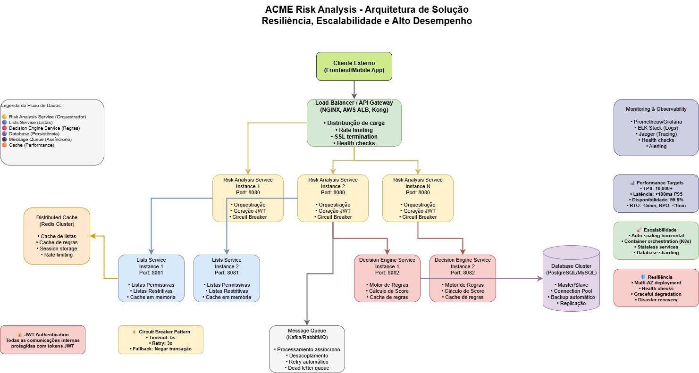

# Desenho da Solução - ACME Risk Analysis

## Visão Geral

Este documento apresenta o desenho detalhado da solução de análise de risco de transações financeiras, com foco em **resiliência**, **escalabilidade** e **alto desempenho**. A arquitetura foi projetada para suportar milhares de transações por segundo (TPS) mantendo alta disponibilidade e tolerância a falhas.

## Arquitetura de Alto Nível

### Componentes Principais

#### 1. Load Balancer / API Gateway
- **Tecnologias**: NGINX, AWS Application Load Balancer, Kong API Gateway
- **Responsabilidades**:
  - Distribuição inteligente de carga entre instâncias
  - Rate limiting para proteção contra DDoS
  - SSL termination e segurança de rede
  - Health checks automáticos
  - Roteamento baseado em path/header

#### 2. Risk Analysis Service (Múltiplas Instâncias)
- **Porta**: 8080
- **Padrão**: Stateless, horizontalmente escalável
- **Responsabilidades**:
  - Orquestração do fluxo de análise de risco
  - Geração de tokens JWT para comunicação interna
  - Implementação de Circuit Breaker pattern
  - Agregação de resultados dos serviços downstream

#### 3. Lists Service (Múltiplas Instâncias)
- **Porta**: 8081
- **Padrão**: Stateless com cache em memória
- **Responsabilidades**:
  - Gerenciamento de listas permissivas e restritivas
  - Cache inteligente para otimização de performance
  - Validação de CPF, IP e Device ID

#### 4. Decision Engine Service (Múltiplas Instâncias)
- **Porta**: 8082
- **Padrão**: Stateless com cache de regras
- **Responsabilidades**:
  - Execução do motor de regras de negócio
  - Cálculo de score de risco
  - Cache de regras para performance otimizada
  - CRUD de regras dinâmicas

## Estratégias de Resiliência

### 1. Circuit Breaker Pattern
- **Implementação**: Hystrix ou Resilience4j
- **Configuração**:
  - Timeout: 5 segundos
  - Retry: 3 tentativas com backoff exponencial
  - Fallback: Negar transação por segurança
- **Benefícios**: Previne cascata de falhas entre serviços

### 2. Health Checks e Auto-Recovery
- **Endpoints**: `/health` em todos os serviços
- **Monitoramento**: Verificação a cada 30 segundos
- **Ação**: Remoção automática de instâncias não saudáveis do load balancer

### 3. Graceful Degradation
- **Cenário**: Falha do Lists Service
- **Comportamento**: Continua análise sem verificação de listas (score mais conservador)
- **Cenário**: Falha do Decision Engine Service
- **Comportamento**: Aplica regras básicas hardcoded ou nega por segurança

### 4. Multi-AZ Deployment
- **Distribuição**: Instâncias em múltiplas zonas de disponibilidade
- **Benefício**: Tolerância a falhas de infraestrutura
- **Replicação**: Database com master/slave em AZs diferentes

## Estratégias de Escalabilidade

### 1. Escalabilidade Horizontal
- **Auto-scaling**: Baseado em CPU, memória e latência
- **Kubernetes**: Horizontal Pod Autoscaler (HPA)
- **Métricas de Trigger**:
  - CPU > 70%
  - Latência P95 > 100ms
  - Queue depth > 1000 mensagens

### 2. Stateless Design
- **Princípio**: Nenhum estado mantido nos serviços
- **Benefício**: Instâncias podem ser adicionadas/removidas dinamicamente
- **Session Storage**: Redis para dados de sessão se necessário

### 3. Database Scaling
- **Read Replicas**: Para consultas de listas e regras
- **Connection Pooling**: HikariCP com configuração otimizada
- **Sharding**: Particionamento por região ou tipo de transação

### 4. Cache Distribuído
- **Tecnologia**: Redis Cluster
- **Estratégia**: Cache-aside pattern
- **TTL**: Configurável por tipo de dado
- **Invalidação**: Event-driven via message queue

## Estratégias de Performance

### 1. Targets de Performance
- **TPS**: 10,000+ transações por segundo
- **Latência**: < 100ms P95 end-to-end
- **Disponibilidade**: 99.9% (8.76 horas de downtime/ano)
- **RTO**: < 5 minutos (Recovery Time Objective)
- **RPO**: < 1 minuto (Recovery Point Objective)

### 2. Otimizações de Comunicação
- **HTTP/2**: Para reduzir latência de rede
- **Connection Pooling**: Reutilização de conexões HTTP
- **Compression**: GZIP para payloads grandes
- **Keep-Alive**: Conexões persistentes

### 3. Processamento Assíncrono
- **Message Queue**: Kafka ou RabbitMQ
- **Casos de Uso**:
  - Auditoria de transações
  - Atualização de métricas
  - Notificações
- **Benefícios**: Desacoplamento e melhor throughput

### 4. Cache Strategy
- **L1 Cache**: Cache local em cada instância (Caffeine)
- **L2 Cache**: Cache distribuído (Redis)
- **Cache Warming**: Pré-carregamento de dados críticos
- **Cache Hierarchy**: Dados mais acessados em cache mais rápido

## Monitoramento e Observabilidade

### 1. Métricas (Prometheus + Grafana)
- **Business Metrics**:
  - Taxa de aprovação/negação
  - Distribuição de scores
  - Volume de transações por tipo
- **Technical Metrics**:
  - Latência por endpoint
  - Taxa de erro por serviço
  - Utilização de recursos

### 2. Logging (ELK Stack)
- **Structured Logging**: JSON format
- **Correlation ID**: Rastreamento de requisições
- **Log Levels**: Configuráveis por ambiente
- **Retention**: 30 dias para produção

### 3. Distributed Tracing (Jaeger)
- **Trace Sampling**: 1% em produção, 100% em desenvolvimento
- **Span Tags**: Informações de contexto de negócio
- **Performance Analysis**: Identificação de gargalos

### 4. Alerting
- **Canais**: Slack, PagerDuty, Email
- **Alertas Críticos**:
  - Latência > 200ms por 5 minutos
  - Taxa de erro > 1% por 2 minutos
  - Disponibilidade < 99% por 1 minuto

## Segurança

### 1. Autenticação JWT
- **Algoritmo**: HS256 (desenvolvimento) / RS256 (produção)
- **Expiração**: 1 hora
- **Refresh**: Automático via interceptors
- **Validação**: Em todos os endpoints protegidos

### 2. Network Security
- **TLS 1.3**: Para todas as comunicações
- **VPC**: Isolamento de rede
- **Security Groups**: Acesso restrito por porta/protocolo
- **WAF**: Proteção contra ataques web

### 3. Data Protection
- **Encryption at Rest**: Database e cache
- **Encryption in Transit**: TLS para todas as comunicações
- **PII Masking**: Logs não expõem dados sensíveis
- **GDPR Compliance**: Direito ao esquecimento

## Disaster Recovery

### 1. Backup Strategy
- **Database**: Backup automático a cada 6 horas
- **Configuration**: Versionamento no Git
- **Secrets**: Backup seguro em vault
- **Retention**: 30 dias para backups

### 2. Recovery Procedures
- **RTO Target**: < 5 minutos
- **RPO Target**: < 1 minuto
- **Automated Failover**: Para componentes críticos
- **Manual Procedures**: Documentados e testados

### 3. Testing
- **Chaos Engineering**: Testes de falha regulares
- **DR Drills**: Simulação de desastres mensalmente
- **Load Testing**: Validação de capacidade
- **Security Testing**: Penetration tests trimestrais

## Considerações de Implementação

### 1. Tecnologias Recomendadas
- **Container Orchestration**: Kubernetes
- **Service Mesh**: Istio (para comunicação avançada)
- **CI/CD**: GitLab CI ou GitHub Actions
- **Infrastructure as Code**: Terraform

### 2. Ambientes
- **Development**: Single instance, H2 database
- **Staging**: Configuração similar à produção
- **Production**: Full HA setup conforme desenho

### 3. Migration Strategy
- **Blue-Green Deployment**: Para atualizações sem downtime
- **Feature Flags**: Para rollout gradual de funcionalidades
- **Database Migrations**: Versionadas e reversíveis

## Conclusão

Este desenho de solução foi projetado para atender aos requisitos de:

- **Alto Volume (TPS)**: Arquitetura horizontalmente escalável suporta 10,000+ TPS
- **Resiliência a Falhas**: Circuit breakers, health checks e graceful degradation
- **Escalabilidade**: Auto-scaling, stateless design e cache distribuído
- **Performance**: Otimizações de rede, cache multi-layer e processamento assíncrono

A implementação atual (versão de desenvolvimento) serve como base sólida para evolução para esta arquitetura de produção, mantendo os princípios de arquitetura hexagonal e segurança JWT já implementados.

---

Desenvolvido por Igor Meira - [meira.igor@gmail.com](mailto:meira.igor@gmail.com)
